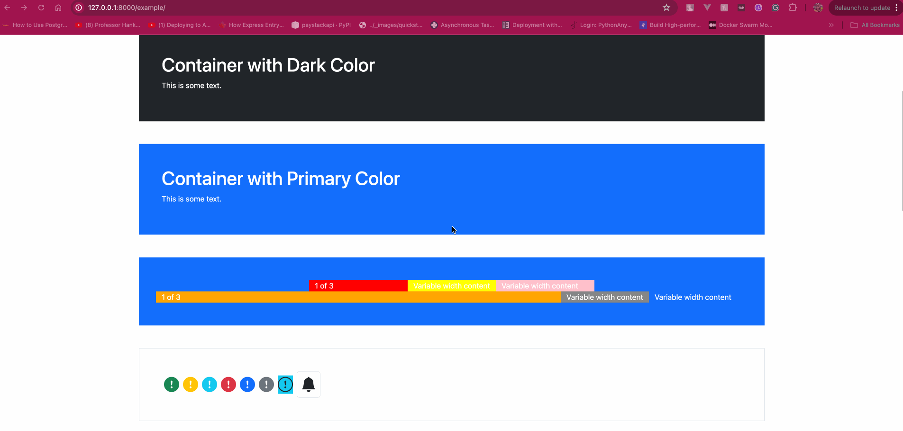

# py-HTML
Building Static HTML and CSS in Python

## Introduction
PyHTML is a library that compiles HTML syntax based on how py-HTML elements are combined. The compiled HTML is still static not JS interactions or Virtual DOM thingy.
It simply provides components that make it easier to build the HTML template faster. 

Although there are Jinja and Mako in this space, I don't intend to make this library a substitute for such a package.

**This is just an experiment.**

## Quick Bootstrap Example

```python
from py_html.contrib.bootstrap.button import BButton, BButtonGroup
from py_html.contrib.bootstrap.breadcrumb import BBreadcrumb, BBreadcrumbItem
from py_html.contrib.bootstrap.main import BootstrapHTML
from py_html.el.base import render_component
from py_html.contrib.bootstrap.icon import BIcon
from py_html.contrib.bootstrap.avatar import BAvatar, BAvatarGroup
from py_html.contrib.bootstrap.layout_grid_system import BContainer, BRow, BCol
from py_html.styles import StyleCSS
import py_html.el as el

from starlette.responses import HTMLResponse

from ellar.common import ModuleRouter

from ellar.app import AppFactory
from ellar_cli.main import create_ellar_cli


def columns_example():
    return el.Fragment(
        BContainer(
            class_name="p-5 my-5 bg-primary text-white",
            content=el.Fragment(
                BRow(
                    class_name="justify-content-md-center",
                    content=[
                        BCol(col=True, lg=2, content="1 of 3", style=StyleCSS(background_color="red")),
                        BCol(cols="12", md="auto", content="Variable width content",
                             style=StyleCSS(background_color="yellow")),
                        BCol(col=True, lg=2, content="Variable width content",
                             style=StyleCSS(background_color="pink")),
                    ]
                ),
                BRow(
                    content=[
                        BCol(content="1 of 3", style=StyleCSS(background_color="orange")),
                        BCol(cols="12", md="auto", content="Variable width content",
                             style=StyleCSS(background_color="gray")),
                        BCol(col=True, lg=2, content="Variable width content",
                             style=StyleCSS(background_color="smoke")),
                    ]
                )
            )
        ),
    )

def container_example():
    return el.Fragment(
        BContainer(
            fluid=True,
            content=(
                el.H1(content="Container Fluid"),
                el.P(content="This is some text."),
            )
        ),
        BContainer(
            class_name="p-5 my-5 border",
            content=(
                el.H1(content="Container"),
                el.P(content="This is some text."),
            )
        ),
        BContainer(
            class_name="p-5 my-5 bg-dark text-white",
            content=(
                el.H1(content="Container with Dark Color"),
                el.P(content="This is some text."),
            )
        ),
        BContainer(
            class_name="p-5 my-5 bg-primary text-white",
            content=(
                el.H1(content="Container with Primary Color"),
                el.P(content="This is some text.")
            )
        ),
    )

def avatar_example():
    return el.Fragment(
        BContainer(
            class_name=f"p-5 my-5 border",
            content=(
                el.H1(content="Avatars Examples"),
                el.Div(class_name="mt-2", content=(
                    lambda ctx: BAvatar(text="Foo", class_name="mx-2", size="72px"),
                    BAvatar(icon="people-fill", class_name="mx-2", size="72px"),
                    BAvatar(
                        icon="people-fill",
                        class_name="mx-2",
                        size="45px",
                        badge='100',
                        variant="primary",
                        badge_variant="dark"
                    ),
                    lambda ctx: BAvatar(
                        icon="people-fill",
                        class_name="mx-2",
                        size="45px",
                        badge=BIcon(icon_name="exclamation-circle-fill", variant="warning"),
                        variant="danger",
                        badge_variant="danger",
                        badge_position="bottom-left"
                    ),
                )),
                el.Hr(),
                el.H1(content="Avatars Group Examples"),
                el.Div(class_name="mt-2", content=(
                    BAvatarGroup(
                        size=f"{i + 1 * 2}rem",
                        over_lap=0.2,
                        content=(
                            BAvatar(text="Foo", size="72px"),
                            BAvatar(icon="people-fill", size="72px"),
                            BAvatar(
                                icon="people-fill",
                                size="45px",
                                badge='100',
                                variant="primary",
                                badge_variant="dark"
                            ),
                            lambda ctx: BAvatar(
                                icon="people-fill",
                                size="45px",
                                badge=BIcon(icon_name="exclamation-circle-fill", variant="warning"),
                                variant="danger",
                                badge_variant="danger",
                                badge_position="bottom-right"
                            ),
                        )
                    )
                    for i in range(5)
                )),

            )
        ),
    )

def icon_example():
    return el.Fragment(
        BContainer(
            class_name="p-5 my-5 border",
            content=el.Div(
                class_name="h2 mb-0",
                content=(
                    BIcon(icon_name="exclamation-circle-fill", class_name="mx-1", variant="success"),
                    BIcon(icon_name="exclamation-circle-fill", class_name="mx-1", variant="warning"),
                    BIcon(icon_name="exclamation-circle-fill", class_name="mx-1", variant="info"),
                    BIcon(icon_name="exclamation-circle-fill", class_name="mx-1", variant="danger"),
                    BIcon(icon_name="exclamation-circle-fill", class_name="mx-1", variant="primary"),
                    BIcon(icon_name="exclamation-circle-fill", class_name="mx-1", variant="secondary"),
                    BIcon(icon_name="exclamation-circle", class_name="mx-1 bg-info", variant="dark", ),
                    BIcon(icon_name="bell-fill", class_name="border rounded p-2 mx-1", variant="dark"),
                )
            )
        ),
    )

def breadcrumb_example():
    return el.Fragment(
        BContainer(
            class_name=f"p-5 my-5 border",
            content=(
                el.H1(content="Breadcrumb Examples"),
                el.Div(
                    content=(
                        BBreadcrumb(
                            {"text": "Home", "href": "https://google.com"},
                            {"text": "Posts", "href": "#"},
                            {"text": 'Another Story', "active": True},
                        ),
                        el.Hr(),
                        BBreadcrumb(
                            content=(
                                BBreadcrumbItem(href="#foo", content="Foo"),
                                BBreadcrumbItem(href="#bar", content="Bar"),
                                BBreadcrumbItem(active=True, content="Baz"),
                            )
                        )
                    )
                )
            )
        ),
    )

def button_example():
    return el.Fragment(
        BContainer(
            class_name=f"p-5 my-5 border",
            content=(
                el.H1(content="Button Example"),
                el.Div(
                    content=(
                        (BButton(pill=True, variant=i, content=i, class_name="mx-2") for i in ["primary", "outline-secondary", "success", "outline-danger", "info"]),
                        el.Hr(),
                        (BButton(squared=True, variant=i, content=i, class_name="mx-2") for i in
                         ["primary", "outline-secondary", "success", "outline-danger", "info"]),
                        el.Hr(),
                        (BButton(variant=i, content=i, class_name="mx-2") for i in
                         ["primary", "secondary", "success", "danger", "warning", "info", "light", "dark"]),
                        el.Hr(),
                        (BButton(variant=f"outline-{i}", content=f"outline-{i}", class_name="mx-2") for i in
                         ["primary", "secondary", "success", "danger", "warning", "info", "light", "dark"]),
                        el.Hr(),
                        BButton(content="Link", variant="link", class_name="mx-2"),
                        el.Hr(),
                        (BButton(content=c, size=i, class_name="mx-2") for i,c in
                         [("sm", "Small"), ("md","Medium"), ("lg","Large")]),
                        el.Hr(),
                        BButtonGroup(
                            size="md",
                            squared=True,
                            content=(
                                BButton(content="Button 1", variant="outline-primary"),
                                BButton(content="Button 2", variant="outline-primary"),
                                BButton(content="Button 3", variant="outline-primary")
                            )
                        )
                    )
                )
            )
        ),
    )


router = ModuleRouter("/example")


@router.get("/", response=HTMLResponse)
def template():
    content = BootstrapHTML(
        content=[
            el.Body(
                content=[
                    columns_example(),
                    icon_example(),
                    avatar_example(),
                    breadcrumb_example(),
                    button_example()
                ]
            )
        ]
    )

    return render_component(content, {})


def bootstrap():
    application = AppFactory.create_app(routers=[router])
    return application


cli = create_ellar_cli("bootstrap_exercise:bootstrap")

if __name__ == "__main__":
    cli()
```


